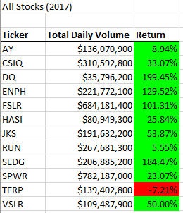
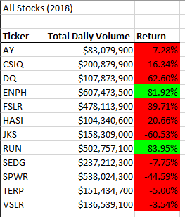
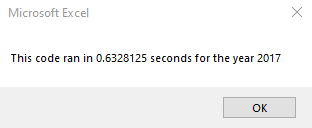
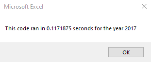
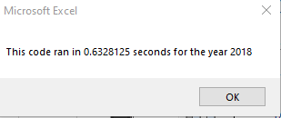
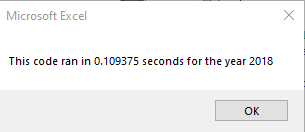

# Stock Analysis

## Overview of Project
The purpose of this project was to create code to help Steve analyze the stock market data from 2017 and 2018 to better inform his parents' investment decisions.

## Results



### Analysis
First, we needed to create an array of all the tickers.
```
    'Initialize array of all tickers
    Dim tickers(12) As String
    
    tickers(0) = "AY"
    tickers(1) = "CSIQ"
    tickers(2) = "DQ"
    tickers(3) = "ENPH"
    tickers(4) = "FSLR"
    tickers(5) = "HASI"
    tickers(6) = "JKS"
    tickers(7) = "RUN"
    tickers(8) = "SEDG"
    tickers(9) = "SPWR"
    tickers(10) = "TERP"
    tickers(11) = "VSLR"

```


Then we needed to loop through all the rows in the sheet and get the total ticker volume (tickerVolumes), starting price (tickerStartingPrices), and ending price (tickerEndingPrices), then increase the ticker index (tickerIndex + 1) if currently on the last row of data for the current ticker.

```
''2b) Loop over all the rows in the spreadsheet.
            For i = 2 To RowCount

        '3a) Increase volume for current ticker
        tickerVolumes(tickerIndex) = tickerVolumes(tickerIndex) + Cells(i, 8).Value
    
            '3b) Check if the current row is the first row with the selected tickerIndex
            'if yes set as tickerStartingPrcies
            If Cells(i, 1).Value = tickers(tickerIndex) And Cells(i - 1, 1).Value <> tickers(tickerIndex) Then
                tickerStartingPrices(tickerIndex) = Cells(i, 6).Value
            End If
    
            '3c) check if the current row is the last row with the selected ticker
            'if yes,  set value as tickerEndingPrices
             If Cells(i, 1).Value = tickers(tickerIndex) And Cells(i + 1, 1).Value <> tickers(tickerIndex) Then
                tickerEndingPrices(tickerIndex) = Cells(i, 6).Value
             End If

            '3d If the next row’s ticker doesn’t match, increase the tickerIndex.
             If Cells(i, 1).Value = tickers(tickerIndex) And Cells(i + 1, 1).Value <> tickers(tickerIndex) Then
                tickerIndex = tickerIndex + 1
            End If

        Next i

```

Then we needed to loop through our arrays and output the Ticker, Total Daily Volume, and Return for each ticker.

```
'4) Loop through your arrays to output the Ticker, Total Daily Volume, and Return.
For i = 0 To 11
    
    Worksheets("AllStocksAnalysis").Activate
    Cells(4 + i, 1).Value = tickers(i)
    Cells(4 + i, 2).Value = tickerVolumes(i)
    Cells(4 + i, 3).Value = tickerEndingPrices(i) / tickerStartingPrices(i) - 1
'end output 4loop
Next i
```

## Summary

### Pros and Cons of Refactoring
Refactoring code can make it appear more organized, as well as decrease the time it takes to run. One downside to refactoring may be that you could potentially introduce new issues into code that is already functioning properly. 

### Refactoring the All Stocks Analysis code
Overall, refactoring this code in particular was helpful as it significantly decreased the time needed to run the macro for both the 2017 and the 2018 datasets. 

For the 2017 dataset, the macro ran approximately 0.51 seconds faster.



For the 2018 dataset, the macro ran approximately 0.52 seconds faster.

