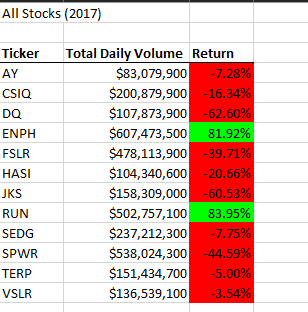
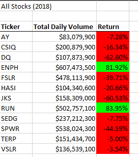

# Stock Analysis

## Overview of Project
The purpose of this project was to create code to help Steve analyze the stock market data from 2017 and 2018 to better inform his parents' investment decisions.

## Results

